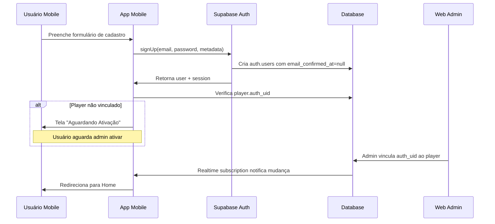

# Game Day Mobile - Especificação Completa

> Aplicativo mobile para jogadores participarem de campanhas gamificadas, responderem perguntas diárias e acumularem GameCoins.

## 📱 Visão Geral

O **Game Day Mobile** é o aplicativo complementar à plataforma web, focado na **experiência do jogador**. Enquanto a aplicação web é para administradores gerenciarem campanhas, perguntas e loja, o app mobile permite que os jogadores participem ativamente do jogo.

### 🎯 Objetivo Principal

Permitir que jogadores:
- Façam login e aguardem ativação por um administrador
- Vejam suas campanhas ativas
- Respondam perguntas diárias dentro das janelas de tempo
- Acumulem pontos e GameCoins
- Visualizem o scoreboard
- Comprem produtos na lojinha com seus GameCoins

---

## 🏗️ Arquitetura do Aplicativo

### Stack Tecnológico Recomendado

```yaml
Framework: React Native (Expo)
Linguagem: TypeScript
Backend: Supabase (PostgreSQL + Auth + Realtime)
Estado Global: React Query + Zustand
Navegação: React Navigation v6
UI Components: React Native Paper / NativeBase
Notificações: Expo Notifications
Cache Local: AsyncStorage / MMKV
```

### Estrutura de Pastas

```
mobile/
├── src/
│   ├── components/          # Componentes reutilizáveis
│   │   ├── QuestionCard.tsx
│   │   ├── CampaignCard.tsx
│   │   ├── ScoreboardItem.tsx
│   │   ├── ProductCard.tsx
│   │   └── CountdownTimer.tsx
│   ├── screens/            # Telas do app
│   │   ├── auth/
│   │   │   ├── LoginScreen.tsx
│   │   │   ├── RegisterScreen.tsx
│   │   │   └── PendingApprovalScreen.tsx
│   │   ├── home/
│   │   │   ├── HomeScreen.tsx
│   │   │   └── CampaignsScreen.tsx
│   │   ├── game/
│   │   │   ├── DailyQuestionsScreen.tsx
│   │   │   ├── QuestionDetailScreen.tsx
│   │   │   └── ScoreboardScreen.tsx
│   │   ├── store/
│   │   │   ├── StoreScreen.tsx
│   │   │   └── PurchaseHistoryScreen.tsx
│   │   └── profile/
│   │       ├── ProfileScreen.tsx
│   │       └── StatsScreen.tsx
│   ├── navigation/         # Navegação
│   │   ├── RootNavigator.tsx
│   │   ├── AuthNavigator.tsx
│   │   └── AppNavigator.tsx
│   ├── services/           # Serviços e APIs
│   │   ├── supabase.ts
│   │   ├── auth.service.ts
│   │   ├── campaign.service.ts
│   │   ├── question.service.ts
│   │   ├── answer.service.ts
│   │   └── store.service.ts
│   ├── hooks/              # Custom hooks
│   │   ├── useAuth.ts
│   │   ├── useCampaigns.ts
│   │   ├── useQuestions.ts
│   │   └── useNotifications.ts
│   ├── utils/              # Utilitários
│   │   ├── dateTime.ts
│   │   ├── points.ts
│   │   └── validators.ts
│   ├── types/              # TypeScript types
│   │   └── index.ts
│   └── constants/          # Constantes
│       └── config.ts
├── assets/                 # Imagens, fontes, etc
├── app.json               # Configuração Expo
├── package.json
└── tsconfig.json
```

---

## 🔐 Sistema de Autenticação e Ativação

### Fluxo de Cadastro e Ativação



### 1. Tela de Cadastro (RegisterScreen)

**Campos do Formulário**:
```typescript
interface RegisterForm {
  fullName: string;        // Nome completo do jogador
  email: string;           // E-mail (único)
  password: string;        // Senha (min 6 caracteres)
  confirmPassword: string; // Confirmação de senha
}
```

**Processo**:
1. Usuário preenche o formulário
2. App valida os campos:
   - E-mail válido
   - Senha com mínimo 6 caracteres
   - Senhas coincidem
3. Chama `supabase.auth.signUp()`:
   ```typescript
   const { data, error } = await supabase.auth.signUp({
     email: form.email,
     password: form.password,
     options: {
       data: {
         full_name: form.fullName,
       },
       emailRedirectTo: 'gameday://auth/callback',
     },
   });
   ```
4. Supabase cria o usuário em `auth.users`
5. App verifica se existe `player.auth_uid` correspondente:
   ```typescript
   const { data: player } = await supabase
     .from('players')
     .select('*')
     .eq('auth_uid', user.id)
     .single();
   ```

### 2. Tela de Aguardando Ativação (PendingApprovalScreen)

**Quando aparece**: Quando `auth.users` existe mas não há `player.auth_uid` correspondente.

**UI**:
```
┌─────────────────────────────────────┐
│                                     │
│         🕒 Aguardando Ativação      │
│                                     │
│  Seu cadastro foi realizado com     │
│  sucesso!                           │
│                                     │
│  Um administrador precisa ativar    │
│  sua conta antes de você poder      │
│  participar das campanhas.          │
│                                     │
│  Você receberá uma notificação      │
│  quando sua conta for ativada.      │
│                                     │
│  ┌─────────────────────────────┐   │
│  │   📧 max.eldon@gmail.com    │   │
│  └─────────────────────────────┘   │
│                                     │
│  [ Sair ]                           │
│                                     │
└─────────────────────────────────────┘
```

**Realtime Subscription**:
```typescript
// Escuta mudanças na tabela players
const subscription = supabase
  .channel('player_activation')
  .on(
    'postgres_changes',
    {
      event: 'UPDATE',
      schema: 'public',
      table: 'players',
      filter: `auth_uid=eq.${user.id}`,
    },
    (payload) => {
      // Quando auth_uid for vinculado, redireciona
      if (payload.new.auth_uid === user.id) {
        navigation.replace('Home');
      }
    }
  )
  .subscribe();
```

### 3. Processo de Ativação (Via Web Admin)

**No Web Admin** (`src/pages/Players.tsx`):

1. Admin vê lista de players sem `auth_uid`
2. Admin vê lista de usuários em `auth.users` sem vínculo
3. Interface permite vincular:
   ```typescript
   const activatePlayer = async (playerId: number, authUid: string) => {
     const { error } = await supabase
       .from('players')
       .update({ auth_uid: authUid })
       .eq('id', playerId);
     
     // Opcionalmente, envia notificação push
     await sendPushNotification(authUid, {
       title: 'Conta Ativada!',
       body: 'Sua conta foi ativada. Abra o app para começar a jogar!',
     });
   };
   ```

### 4. Login (LoginScreen)

**Campos**:
- E-mail
- Senha

**Processo**:
```typescript
const handleLogin = async () => {
  const { data, error } = await supabase.auth.signInWithPassword({
    email: form.email,
    password: form.password,
  });
  
  if (error) {
    showError(error.message);
    return;
  }
  
  // Verifica se player está ativado
  const { data: player } = await supabase
    .from('players')
    .select('*')
    .eq('auth_uid', data.user.id)
    .single();
  
  if (!player) {
    navigation.navigate('PendingApproval');
  } else {
    navigation.replace('Home');
  }
};
```

---

## 🎮 Funcionalidades Principais

### 1. Home Screen

**Conteúdo**:
- Header com foto e nome do jogador
- Saldo de GameCoins
- Pontuação total
- Lista de campanhas ativas
- Perguntas pendentes do dia
- Botão de acesso rápido ao Scoreboard

**Layout**:
```
┌─────────────────────────────────────┐
│  👤 João Silva          🪙 1,250    │
│  📊 Total: 3,450 pontos             │
├─────────────────────────────────────┤
│                                     │
│  📅 Campanhas Ativas                │
│  ┌─────────────────────────────┐   │
│  │ 🎯 Campanha de Matemática   │   │
│  │ 📊 Sua posição: 3º          │   │
│  │ 🏆 1,200 pts                │   │
│  └─────────────────────────────┘   │
│                                     │
│  ❓ Perguntas de Hoje               │
│  ┌─────────────────────────────┐   │
│  │ ⏰ Pergunta Especial         │   │
│  │ Aberta em: 00:45:12         │   │
│  │ 🌟 300 pontos máximo        │   │
│  └─────────────────────────────┘   │
│  ┌─────────────────────────────┐   │
│  │ ✅ Respondida - 100 pts     │   │
│  └─────────────────────────────┘   │
│                                     │
│  [ Ver Scoreboard ]                 │
│                                     │
└─────────────────────────────────────┘
```

**Queries necessárias**:
```typescript
// Buscar dados do jogador
const { data: player } = await supabase
  .from('players')
  .select('*, player_campaign_scores(*)')
  .eq('auth_uid', user.id)
  .single();

// Buscar campanhas ativas do jogador
const { data: campaigns } = await supabase
  .from('campaign_players')
  .select('campaigns!inner(*)')
  .eq('player_id', player.id)
  .eq('campaigns.status', 'in-progress');

// Buscar perguntas de hoje (não respondidas)
const today = new Date().toISOString().split('T')[0];
const { data: questions } = await supabase
  .from('questions')
  .select('*')
  .in('campaign_id', campaigns.map(c => c.id))
  .not('id', 'in', 
    supabase.from('answers')
      .select('question_id')
      .eq('player_id', player.id)
  );
```

### 2. Daily Questions Screen

**Lista de Perguntas do Dia**:

Categorias:
- **🌟 Perguntas Especiais**: Destaque no topo, com countdown
- **✅ Respondidas**: Marcadas como concluídas
- **⏰ Disponíveis**: Dentro da janela de horário
- **🔒 Bloqueadas**: Fora do horário de abertura

**Card de Pergunta**:
```typescript
interface QuestionCardProps {
  question: Question;
  status: 'special' | 'available' | 'answered' | 'locked';
  onPress: () => void;
}
```

**UI do Card**:
```
┌─────────────────────────────────────┐
│ 🌟 Pergunta Especial - Dia 3        │
│                                     │
│ ⏱️ Janela Especial: 00:45:12        │
│ 🏆 300 pontos (depois: 150)         │
│                                     │
│ [ RESPONDER AGORA ]                 │
└─────────────────────────────────────┘

┌─────────────────────────────────────┐
│ 📝 Pergunta Normal - Dia 2          │
│                                     │
│ ⏰ Disponível até 18:00             │
│ 💯 100 pontos (tarde: 50)           │
│                                     │
│ [ Responder ]                       │
└─────────────────────────────────────┘

┌─────────────────────────────────────┐
│ ✅ Pergunta - Dia 1                 │
│                                     │
│ ✓ Respondida às 10:30               │
│ 🎯 +100 pontos ganhos               │
│                                     │
│ [ Ver Resposta ]                    │
└─────────────────────────────────────┘

┌─────────────────────────────────────┐
│ 🔒 Pergunta - Dia 4                 │
│                                     │
│ 🕐 Abre às 08:00                    │
│ 💯 100 pontos possíveis             │
│                                     │
│ [ Bloqueada ]                       │
└─────────────────────────────────────┘
```

**Lógica de Status**:
```typescript
const getQuestionStatus = (question: Question, playerAnswers: Answer[]) => {
  // Verifica se já respondeu
  const answered = playerAnswers.some(a => a.questionId === question.id);
  if (answered) return 'answered';
  
  const now = new Date();
  
  // Pergunta especial
  if (question.isSpecial && question.specialStartAt) {
    const specialStart = new Date(question.specialStartAt);
    const specialEnd = new Date(
      specialStart.getTime() + (question.specialWindowMinutes || 1) * 60000
    );
    
    if (now >= specialStart && now <= specialEnd) {
      return 'special'; // Dentro da janela especial
    }
  }
  
  // Verifica horário de abertura
  if (question.scheduleTime) {
    const [hours, minutes] = question.scheduleTime.split(':');
    const scheduleDate = new Date(now);
    scheduleDate.setHours(parseInt(hours), parseInt(minutes), 0, 0);
    
    if (now < scheduleDate) {
      return 'locked'; // Ainda não abriu
    }
  }
  
  // Verifica deadline
  if (question.deadlineTime) {
    const [hours, minutes] = question.deadlineTime.split(':');
    const deadlineDate = new Date(now);
    deadlineDate.setHours(parseInt(hours), parseInt(minutes), 0, 0);
    
    if (now > deadlineDate) {
      return 'late'; // Passou do deadline (pode responder com pontos reduzidos)
    }
  }
  
  return 'available'; // Disponível para responder
};
```

### 3. Question Detail Screen

**Tela de Resposta de Pergunta**:

```
┌─────────────────────────────────────┐
│  ← Voltar                           │
├─────────────────────────────────────┤
│                                     │
│  🌟 Pergunta Especial - Dia 3       │
│                                     │
│  ⏱️ Tempo restante: 00:45:12        │
│  🏆 300 pontos nesta janela         │
│  📉 150 pontos depois               │
│                                     │
├─────────────────────────────────────┤
│                                     │
│  Qual é a capital do Brasil?        │
│                                     │
│  ○ São Paulo                        │
│  ○ Rio de Janeiro                   │
│  ● Brasília                         │
│  ○ Salvador                         │
│                                     │
├─────────────────────────────────────┤
│                                     │
│  [ CONFIRMAR RESPOSTA ]             │
│                                     │
│  ⚠️ Você só pode responder uma vez! │
│                                     │
└─────────────────────────────────────┘
```

**Componente de Countdown Timer**:
```typescript
const CountdownTimer: React.FC<{ targetDate: Date }> = ({ targetDate }) => {
  const [timeLeft, setTimeLeft] = useState(getTimeLeft(targetDate));
  
  useEffect(() => {
    const timer = setInterval(() => {
      setTimeLeft(getTimeLeft(targetDate));
    }, 1000);
    
    return () => clearInterval(timer);
  }, [targetDate]);
  
  return (
    <View>
      <Text style={styles.timer}>
        {formatTime(timeLeft)}
      </Text>
    </View>
  );
};

const getTimeLeft = (target: Date) => {
  const now = new Date().getTime();
  const difference = target.getTime() - now;
  
  if (difference <= 0) return { hours: 0, minutes: 0, seconds: 0 };
  
  return {
    hours: Math.floor(difference / (1000 * 60 * 60)),
    minutes: Math.floor((difference / 1000 / 60) % 60),
    seconds: Math.floor((difference / 1000) % 60),
  };
};
```

**Submissão de Resposta**:
```typescript
const submitAnswer = async (questionId: number, selectedAnswer: number) => {
  try {
    // Chama RPC function que calcula pontos automaticamente
    const { data, error } = await supabase.rpc('submit_answer', {
      p_player_id: player.id,
      p_question_id: questionId,
      p_campaign_id: campaign.id,
      p_selected_answer: selectedAnswer,
    });
    
    if (error) throw error;
    
    // Mostra resultado
    const result = data[0];
    showResultModal({
      isCorrect: result.is_correct,
      pointsEarned: result.points_earned,
      isOnTime: result.is_on_time,
    });
    
    // Atualiza dados locais
    queryClient.invalidateQueries(['player']);
    queryClient.invalidateQueries(['questions']);
    
  } catch (error) {
    showError('Erro ao enviar resposta');
  }
};
```

**Modal de Resultado**:
```
┌─────────────────────────────────────┐
│                                     │
│         ✅ RESPOSTA CORRETA!        │
│                                     │
│    Você ganhou 300 pontos! 🎉      │
│                                     │
│  ⏰ Respondido dentro da janela     │
│     especial!                       │
│                                     │
│  Novo saldo: 🪙 1,550 GameCoins    │
│                                     │
│  [ Continuar ]                      │
│                                     │
└─────────────────────────────────────┘
```

### 4. Scoreboard Screen

**Ranking por Campanha**:

```
┌─────────────────────────────────────┐
│  🏆 Classificação                   │
│                                     │
│  📅 Campanha de Matemática          │
│                                     │
├─────────────────────────────────────┤
│  🥇 1º  Maria Santos    2,450 pts   │
│  🥈 2º  Pedro Oliveira  2,100 pts   │
│  🥉 3º  João Silva      1,200 pts ← │
│      4º  Ana Costa      1,050 pts   │
│      5º  Carlos Lima      980 pts   │
│      6º  Beatriz Ramos    850 pts   │
│                                     │
│  [ Ver Todas Campanhas ]            │
└─────────────────────────────────────┘
```

**Query**:
```typescript
const { data: scoreboard } = await supabase
  .from('player_campaign_scores')
  .select(`
    player_id,
    score,
    players!inner(name, auth_uid)
  `)
  .eq('campaign_id', campaignId)
  .order('score', { ascending: false });
```

### 5. Store Screen (Lojinha)

**Lista de Produtos**:

```
┌─────────────────────────────────────┐
│  🛍️ Lojinha                         │
│                                     │
│  💰 Seu saldo: 1,550 GameCoins      │
│                                     │
├─────────────────────────────────────┤
│  🎁 Produtos Disponíveis            │
│                                     │
│  ┌─────────────────────────────┐   │
│  │ 🎮 Fone Gamer               │   │
│  │ ━━━━━━━━━━━━━━━━━━━━━━     │   │
│  │ [Imagem do produto]         │   │
│  │ ━━━━━━━━━━━━━━━━━━━━━━     │   │
│  │ Fone com microfone RGB      │   │
│  │                             │   │
│  │ 💰 800 GameCoins            │   │
│  │ 📦 5 unidades restantes     │   │
│  │                             │   │
│  │ [ COMPRAR ]                 │   │
│  └─────────────────────────────┘   │
│                                     │
│  ┌─────────────────────────────┐   │
│  │ 📚 Kit de Livros            │   │
│  │ ━━━━━━━━━━━━━━━━━━━━━━     │   │
│  │ [Imagem do produto]         │   │
│  │ ━━━━━━━━━━━━━━━━━━━━━━     │   │
│  │ Coleção com 3 livros        │   │
│  │                             │   │
│  │ 💰 1,200 GameCoins          │   │
│  │ 📦 2 unidades restantes     │   │
│  │                             │   │
│  │ [ Saldo Insuficiente ]      │   │
│  └─────────────────────────────┘   │
│                                     │
│  [ Histórico de Compras ]           │
└─────────────────────────────────────┘
```

**Query de Produtos Disponíveis**:
```typescript
const today = new Date().toISOString().split('T')[0];

const { data: products } = await supabase
  .from('products')
  .select('*')
  .eq('campaign_id', campaignId)
  .gte('quantity', 1) // tem estoque
  .lte('available_from', today)
  .gte('available_until', today)
  .order('created_at', { ascending: false });
```

**Compra de Produto**:
```typescript
const purchaseProduct = async (productId: number) => {
  try {
    // Verifica saldo
    if (player.gameCoins < product.priceInGameCoins) {
      showError('Saldo insuficiente!');
      return;
    }
    
    // Chama RPC function para compra atômica
    const { data, error } = await supabase.rpc('purchase_product', {
      p_player_id: player.id,
      p_product_id: productId,
      p_campaign_id: campaignId,
    });
    
    if (error) throw error;
    
    showSuccess('Compra realizada com sucesso!');
    queryClient.invalidateQueries(['player']);
    queryClient.invalidateQueries(['products']);
    
  } catch (error) {
    showError('Erro ao realizar compra');
  }
};
```

**RPC Function `purchase_product`** (no SQL):
```sql
CREATE OR REPLACE FUNCTION purchase_product(
  p_player_id INTEGER,
  p_product_id INTEGER,
  p_campaign_id INTEGER
) RETURNS JSONB AS $$
DECLARE
  v_player RECORD;
  v_product RECORD;
  v_result JSONB;
BEGIN
  -- Lock player row
  SELECT * INTO v_player FROM players WHERE id = p_player_id FOR UPDATE;
  
  -- Lock product row
  SELECT * INTO v_product FROM products WHERE id = p_product_id FOR UPDATE;
  
  -- Validações
  IF v_product.quantity < 1 THEN
    RAISE EXCEPTION 'Produto esgotado';
  END IF;
  
  IF v_player.game_coins < v_product.price_in_game_coins THEN
    RAISE EXCEPTION 'Saldo insuficiente';
  END IF;
  
  -- Atualiza estoque
  UPDATE products 
  SET quantity = quantity - 1 
  WHERE id = p_product_id;
  
  -- Deduz GameCoins
  UPDATE players 
  SET game_coins = game_coins - v_product.price_in_game_coins 
  WHERE id = p_player_id;
  
  -- Registra compra
  INSERT INTO purchases (player_id, product_id, campaign_id, price_in_game_coins)
  VALUES (p_player_id, p_product_id, p_campaign_id, v_product.price_in_game_coins);
  
  -- Retorna resultado
  v_result := jsonb_build_object(
    'success', true,
    'new_balance', (SELECT game_coins FROM players WHERE id = p_player_id)
  );
  
  RETURN v_result;
END;
$$ LANGUAGE plpgsql;
```

### 6. Profile Screen

**Perfil do Jogador**:

```
┌─────────────────────────────────────┐
│          👤 João Silva              │
│                                     │
│  📧 joao.silva@email.com            │
│  🎮 Membro desde: 15/01/2025        │
│                                     │
├─────────────────────────────────────┤
│  📊 Estatísticas Gerais             │
│                                     │
│  🏆 Pontuação Total: 3,450          │
│  🪙 GameCoins: 1,550                │
│  ✅ Perguntas Respondidas: 42       │
│  🎯 Taxa de Acerto: 85%             │
│  ⏰ Respostas no Prazo: 38 (90%)    │
│                                     │
├─────────────────────────────────────┤
│  🏅 Conquistas                      │
│                                     │
│  🥇 Primeiro Lugar em 2 campanhas   │
│  🌟 10 perguntas especiais acertadas│
│  🔥 7 dias consecutivos respondendo │
│                                     │
├─────────────────────────────────────┤
│                                     │
│  [ Alterar Senha ]                  │
│  [ Histórico de Compras ]           │
│  [ Sair ]                           │
│                                     │
└─────────────────────────────────────┘
```

**Queries**:
```typescript
// Estatísticas do jogador
const { data: stats } = await supabase
  .rpc('get_player_stats', { p_player_id: player.id });

// RPC function
CREATE OR REPLACE FUNCTION get_player_stats(p_player_id INTEGER)
RETURNS JSONB AS $$
DECLARE
  v_result JSONB;
BEGIN
  SELECT jsonb_build_object(
    'total_score', COALESCE(score, 0),
    'game_coins', COALESCE(game_coins, 0),
    'total_answers', (SELECT COUNT(*) FROM answers WHERE player_id = p_player_id),
    'correct_answers', (SELECT COUNT(*) FROM answers WHERE player_id = p_player_id AND is_correct = true),
    'on_time_answers', (SELECT COUNT(*) FROM answers WHERE player_id = p_player_id AND is_on_time = true),
    'campaigns_count', (SELECT COUNT(*) FROM campaign_players WHERE player_id = p_player_id),
    'purchases_count', (SELECT COUNT(*) FROM purchases WHERE player_id = p_player_id)
  ) INTO v_result
  FROM players
  WHERE id = p_player_id;
  
  RETURN v_result;
END;
$$ LANGUAGE plpgsql;
```

---

## 🔔 Sistema de Notificações Push

### Eventos que Disparam Notificações

1. **Conta Ativada**
   - Trigger: Admin vincula `auth_uid` ao player
   - Título: "Conta Ativada! 🎉"
   - Corpo: "Sua conta foi ativada. Abra o app para começar a jogar!"

2. **Nova Pergunta Disponível**
   - Trigger: Horário de abertura da pergunta
   - Título: "Nova Pergunta Disponível! 📝"
   - Corpo: "Responda até 18:00 e ganhe 100 pontos"

3. **Pergunta Especial em Breve**
   - Trigger: 5 minutos antes da janela especial
   - Título: "⚠️ Pergunta Especial em 5 minutos!"
   - Corpo: "Se prepare para ganhar 300 pontos! 🌟"

4. **Pergunta Especial Aberta**
   - Trigger: Início da janela especial
   - Título: "🌟 PERGUNTA ESPECIAL ABERTA!"
   - Corpo: "Você tem 1 minuto para ganhar 300 pontos!"

5. **Deadline Próximo**
   - Trigger: 1 hora antes do deadline
   - Título: "⏰ Última Hora!"
   - Corpo: "Você ainda tem perguntas não respondidas hoje"

6. **Novo Produto na Loja**
   - Trigger: Produto entra em disponibilidade
   - Título: "🛍️ Novo Produto Disponível!"
   - Corpo: "Confira o novo item na lojinha"

7. **Compra Confirmada**
   - Trigger: Após purchase bem-sucedido
   - Título: "✅ Compra Realizada!"
   - Corpo: "Você comprou [produto]. Novo saldo: X GameCoins"

### Implementação com Expo Notifications

**1. Configuração Inicial**:
```typescript
// src/services/notifications.service.ts
import * as Notifications from 'expo-notifications';
import * as Device from 'expo-device';
import { Platform } from 'react-native';
import { supabase } from './supabase';

// Configurar comportamento padrão
Notifications.setNotificationHandler({
  handleNotification: async () => ({
    shouldShowAlert: true,
    shouldPlaySound: true,
    shouldSetBadge: true,
  }),
});

// Registrar para push notifications
export async function registerForPushNotifications() {
  let token;
  
  if (Device.isDevice) {
    const { status: existingStatus } = await Notifications.getPermissionsAsync();
    let finalStatus = existingStatus;
    
    if (existingStatus !== 'granted') {
      const { status } = await Notifications.requestPermissionsAsync();
      finalStatus = status;
    }
    
    if (finalStatus !== 'granted') {
      throw new Error('Failed to get push token for push notification!');
    }
    
    token = (await Notifications.getExpoPushTokenAsync()).data;
  }
  
  if (Platform.OS === 'android') {
    Notifications.setNotificationChannelAsync('default', {
      name: 'default',
      importance: Notifications.AndroidImportance.MAX,
      vibrationPattern: [0, 250, 250, 250],
      lightColor: '#FF231F7C',
    });
  }
  
  return token;
}

// Salvar token no banco
export async function savePushToken(playerId: number, token: string) {
  await supabase
    .from('players')
    .update({ push_token: token })
    .eq('id', playerId);
}
```

**2. Adicionar campo `push_token` na tabela players**:
```sql
ALTER TABLE players ADD COLUMN push_token TEXT;
CREATE INDEX idx_players_push_token ON players(push_token);
```

**3. Backend para Enviar Notificações** (Supabase Edge Function):
```typescript
// supabase/functions/send-notification/index.ts
import { serve } from 'https://deno.land/std@0.168.0/http/server.ts';

interface NotificationPayload {
  to: string; // Expo push token
  title: string;
  body: string;
  data?: any;
}

serve(async (req) => {
  const { playerIds, title, body, data } = await req.json();
  
  // Buscar push tokens
  const { data: players } = await supabaseAdmin
    .from('players')
    .select('push_token')
    .in('id', playerIds)
    .not('push_token', 'is', null);
  
  const tokens = players.map(p => p.push_token);
  
  // Enviar via Expo Push API
  const messages: NotificationPayload[] = tokens.map(token => ({
    to: token,
    title,
    body,
    data,
  }));
  
  const response = await fetch('https://exp.host/--/api/v2/push/send', {
    method: 'POST',
    headers: {
      'Content-Type': 'application/json',
    },
    body: JSON.stringify(messages),
  });
  
  return new Response(JSON.stringify({ success: true }), {
    headers: { 'Content-Type': 'application/json' },
  });
});
```

**4. Scheduled Notifications com Supabase Cron**:
```sql
-- Notificar perguntas disponíveis
-- Roda todo dia às 08:00
SELECT cron.schedule(
  'notify-daily-questions',
  '0 8 * * *',
  $$
  SELECT net.http_post(
    url := 'https://[project].supabase.co/functions/v1/send-notification',
    headers := jsonb_build_object('Authorization', 'Bearer [anon-key]'),
    body := jsonb_build_object(
      'playerIds', (SELECT array_agg(DISTINCT cp.player_id) FROM campaign_players cp),
      'title', 'Nova Pergunta Disponível! 📝',
      'body', 'Responda até 18:00 e ganhe pontos!'
    )
  );
  $$
);
```

---

## 🗄️ Banco de Dados e Conexões

### Configuração do Supabase

**1. Arquivo de Configuração** (`src/services/supabase.ts`):
```typescript
import { createClient } from '@supabase/supabase-js';
import AsyncStorage from '@react-native-async-storage/async-storage';

const supabaseUrl = process.env.EXPO_PUBLIC_SUPABASE_URL!;
const supabaseAnonKey = process.env.EXPO_PUBLIC_SUPABASE_ANON_KEY!;

export const supabase = createClient(supabaseUrl, supabaseAnonKey, {
  auth: {
    storage: AsyncStorage,
    autoRefreshToken: true,
    persistSession: true,
    detectSessionInUrl: false,
  },
});
```

**2. Arquivo `.env`**:
```env
EXPO_PUBLIC_SUPABASE_URL=https://vhphsaodwurjnwrnxflm.supabase.co
EXPO_PUBLIC_SUPABASE_ANON_KEY=eyJhbGciOiJIUzI1NiIsInR5cCI6IkpXVCJ9...
```

### Row Level Security (RLS) Policies

**Políticas para o App Mobile**:

```sql
-- Players: usuário só vê seus próprios dados
CREATE POLICY "Players can view own record"
  ON players FOR SELECT
  USING (auth.uid()::text = auth_uid);

CREATE POLICY "Players can update own record"
  ON players FOR UPDATE
  USING (auth.uid()::text = auth_uid);

-- Campaigns: visualização pública de campanhas ativas
CREATE POLICY "Anyone can view active campaigns"
  ON campaigns FOR SELECT
  USING (status = 'in-progress');

-- Campaign Players: jogador vê suas próprias vinculações
CREATE POLICY "Players view own campaign enrollments"
  ON campaign_players FOR SELECT
  USING (
    player_id IN (
      SELECT id FROM players WHERE auth_uid = auth.uid()::text
    )
  );

-- Questions: jogador vê perguntas das campanhas em que está
CREATE POLICY "Players view questions from enrolled campaigns"
  ON questions FOR SELECT
  USING (
    campaign_id IN (
      SELECT cp.campaign_id 
      FROM campaign_players cp
      JOIN players p ON p.id = cp.player_id
      WHERE p.auth_uid = auth.uid()::text
    )
  );

-- Answers: jogador vê apenas suas respostas
CREATE POLICY "Players view own answers"
  ON answers FOR SELECT
  USING (
    player_id IN (
      SELECT id FROM players WHERE auth_uid = auth.uid()::text
    )
  );

CREATE POLICY "Players can insert own answers"
  ON answers FOR INSERT
  WITH CHECK (
    player_id IN (
      SELECT id FROM players WHERE auth_uid = auth.uid()::text
    )
  );

-- Products: visualização pública de produtos disponíveis
CREATE POLICY "Anyone can view available products"
  ON products FOR SELECT
  USING (
    quantity > 0 
    AND available_from <= CURRENT_DATE 
    AND available_until >= CURRENT_DATE
  );

-- Purchases: jogador vê apenas suas compras
CREATE POLICY "Players view own purchases"
  ON purchases FOR SELECT
  USING (
    player_id IN (
      SELECT id FROM players WHERE auth_uid = auth.uid()::text
    )
  );

CREATE POLICY "Players can insert own purchases"
  ON purchases FOR INSERT
  WITH CHECK (
    player_id IN (
      SELECT id FROM players WHERE auth_uid = auth.uid()::text
    )
  );
```

### Sincronização Offline

**Strategy usando React Query**:

```typescript
// src/services/offline.service.ts
import { QueryClient } from '@tanstack/react-query';
import NetInfo from '@react-native-community/netinfo';
import AsyncStorage from '@react-native-async-storage/async-storage';

export const queryClient = new QueryClient({
  defaultOptions: {
    queries: {
      cacheTime: 1000 * 60 * 60 * 24, // 24 horas
      staleTime: 1000 * 60 * 5, // 5 minutos
      retry: 3,
      retryDelay: (attemptIndex) => Math.min(1000 * 2 ** attemptIndex, 30000),
      networkMode: 'offlineFirst', // Funciona offline se tem cache
    },
    mutations: {
      retry: 3,
      networkMode: 'online', // Mutações só funcionam online
    },
  },
});

// Persistir cache localmente
export async function persistQueryCache() {
  const cache = queryClient.getQueryCache();
  await AsyncStorage.setItem('react-query-cache', JSON.stringify(cache));
}

// Restaurar cache
export async function restoreQueryCache() {
  const cached = await AsyncStorage.getItem('react-query-cache');
  if (cached) {
    const cache = JSON.parse(cached);
    queryClient.setQueryData(['cache'], cache);
  }
}

// Listener de conectividade
NetInfo.addEventListener((state) => {
  if (state.isConnected) {
    // Quando voltar online, refaz queries falhadas
    queryClient.refetchQueries({ type: 'inactive' });
  }
});
```

**Queue de Respostas Offline**:

```typescript
// src/services/answerQueue.service.ts
interface QueuedAnswer {
  id: string;
  questionId: number;
  selectedAnswer: number;
  timestamp: number;
}

const QUEUE_KEY = 'answer_queue';

export async function queueAnswer(questionId: number, selectedAnswer: number) {
  const queue = await getQueue();
  const newAnswer: QueuedAnswer = {
    id: `${Date.now()}-${questionId}`,
    questionId,
    selectedAnswer,
    timestamp: Date.now(),
  };
  
  queue.push(newAnswer);
  await AsyncStorage.setItem(QUEUE_KEY, JSON.stringify(queue));
}

export async function processQueue() {
  const queue = await getQueue();
  
  for (const answer of queue) {
    try {
      await submitAnswer(answer.questionId, answer.selectedAnswer);
      // Remove da fila se sucesso
      await removeFromQueue(answer.id);
    } catch (error) {
      console.error('Failed to process queued answer:', error);
    }
  }
}

async function getQueue(): Promise<QueuedAnswer[]> {
  const data = await AsyncStorage.getItem(QUEUE_KEY);
  return data ? JSON.parse(data) : [];
}

async function removeFromQueue(id: string) {
  const queue = await getQueue();
  const filtered = queue.filter(a => a.id !== id);
  await AsyncStorage.setItem(QUEUE_KEY, JSON.stringify(filtered));
}
```

---

## 🎨 Design System e UI/UX

### Cores e Tema

```typescript
// src/constants/theme.ts
export const theme = {
  colors: {
    primary: '#3b82f6',      // Blue
    secondary: '#8b5cf6',    // Purple
    accent: '#06b6d4',       // Cyan
    success: '#22c55e',      // Green
    warning: '#eab308',      // Yellow
    error: '#ef4444',        // Red
    background: '#0f172a',   // Dark blue
    card: '#1e293b',         // Lighter dark
    text: '#f1f5f9',         // Light gray
    textMuted: '#94a3b8',    // Medium gray
    border: '#334155',       // Border gray
  },
  spacing: {
    xs: 4,
    sm: 8,
    md: 16,
    lg: 24,
    xl: 32,
    xxl: 48,
  },
  borderRadius: {
    sm: 4,
    md: 8,
    lg: 12,
    xl: 16,
    full: 9999,
  },
  typography: {
    h1: { fontSize: 32, fontWeight: 'bold' },
    h2: { fontSize: 24, fontWeight: 'bold' },
    h3: { fontSize: 20, fontWeight: '600' },
    body: { fontSize: 16, fontWeight: 'normal' },
    caption: { fontSize: 14, fontWeight: 'normal' },
    small: { fontSize: 12, fontWeight: 'normal' },
  },
};
```

### Componentes Reutilizáveis

**Button Component**:
```typescript
// src/components/Button.tsx
interface ButtonProps {
  title: string;
  onPress: () => void;
  variant?: 'primary' | 'secondary' | 'outline' | 'ghost';
  size?: 'sm' | 'md' | 'lg';
  disabled?: boolean;
  loading?: boolean;
  icon?: React.ReactNode;
}

export const Button: React.FC<ButtonProps> = ({
  title,
  onPress,
  variant = 'primary',
  size = 'md',
  disabled = false,
  loading = false,
  icon,
}) => {
  // Implementation
};
```

**Card Component**:
```typescript
// src/components/Card.tsx
interface CardProps {
  children: React.ReactNode;
  onPress?: () => void;
  variant?: 'default' | 'outlined' | 'elevated';
}

export const Card: React.FC<CardProps> = ({
  children,
  onPress,
  variant = 'default',
}) => {
  // Implementation
};
```

---

## 📊 Analytics e Tracking

### Eventos a Rastrear

1. **Autenticação**:
   - `user_registered`
   - `user_logged_in`
   - `user_logged_out`
   - `account_activated`

2. **Gameplay**:
   - `question_viewed`
   - `answer_submitted`
   - `special_question_answered`
   - `correct_answer`
   - `incorrect_answer`
   - `late_answer`

3. **Loja**:
   - `product_viewed`
   - `product_purchased`
   - `insufficient_balance`

4. **Navegação**:
   - `screen_view`
   - `scoreboard_viewed`
   - `profile_viewed`

### Implementação com Firebase Analytics

```typescript
// src/services/analytics.service.ts
import analytics from '@react-native-firebase/analytics';

export const trackEvent = async (eventName: string, params?: object) => {
  await analytics().logEvent(eventName, params);
};

export const trackScreenView = async (screenName: string) => {
  await analytics().logScreenView({
    screen_name: screenName,
    screen_class: screenName,
  });
};

// Uso
trackEvent('answer_submitted', {
  question_id: 123,
  is_correct: true,
  points_earned: 100,
  is_special: false,
});
```

---

## 🚀 Deployment e Distribuição

### Build e Publicação

**1. Configuração EAS (Expo Application Services)**:

```json
// eas.json
{
  "cli": {
    "version": ">= 3.0.0"
  },
  "build": {
    "development": {
      "developmentClient": true,
      "distribution": "internal"
    },
    "preview": {
      "distribution": "internal",
      "android": {
        "buildType": "apk"
      },
      "ios": {
        "simulator": true
      }
    },
    "production": {
      "android": {
        "buildType": "app-bundle"
      },
      "ios": {
        "buildType": "archive"
      }
    }
  },
  "submit": {
    "production": {
      "android": {
        "serviceAccountKeyPath": "./google-service-account.json",
        "track": "internal"
      },
      "ios": {
        "appleId": "your-apple-id@email.com",
        "ascAppId": "1234567890",
        "appleTeamId": "ABCDEF1234"
      }
    }
  }
}
```

**2. Build Commands**:
```bash
# Android Development
eas build --profile development --platform android

# iOS Development
eas build --profile development --platform ios

# Production Build
eas build --profile production --platform all

# Submit to Stores
eas submit --platform android
eas submit --platform ios
```

**3. OTA Updates** (Over-The-Air):
```bash
# Publicar update sem rebuild
eas update --branch production --message "Bug fixes"

# Auto-update configuration
{
  "updates": {
    "url": "https://u.expo.dev/[project-id]",
    "checkAutomatically": "ON_LOAD",
    "fallbackToCacheTimeout": 0
  }
}
```

---

## 🧪 Testes

### Estratégia de Testes

**1. Unit Tests (Jest)**:
```typescript
// __tests__/utils/points.test.ts
import { calculatePoints } from '../src/utils/points';

describe('calculatePoints', () => {
  it('should return on-time points when answered within schedule', () => {
    const result = calculatePoints({
      isCorrect: true,
      isOnTime: true,
      pointsOnTime: 100,
      pointsLate: 50,
    });
    expect(result).toBe(100);
  });
  
  it('should return late points when answered after deadline', () => {
    const result = calculatePoints({
      isCorrect: true,
      isOnTime: false,
      pointsOnTime: 100,
      pointsLate: 50,
    });
    expect(result).toBe(50);
  });
});
```

**2. Integration Tests (Detox)**:
```typescript
// e2e/login.e2e.ts
describe('Login Flow', () => {
  beforeAll(async () => {
    await device.launchApp();
  });

  it('should login successfully', async () => {
    await element(by.id('email-input')).typeText('test@example.com');
    await element(by.id('password-input')).typeText('password123');
    await element(by.id('login-button')).tap();
    
    await waitFor(element(by.id('home-screen')))
      .toBeVisible()
      .withTimeout(5000);
  });
});
```

---

## 📚 Documentação para Desenvolvedores

### Setup Local

```bash
# Clone o repositório
git clone https://github.com/maxpowernet/game_day_mobile.git
cd game_day_mobile

# Instalar dependências
npm install

# Configurar variáveis de ambiente
cp .env.example .env
# Editar .env com suas credenciais Supabase

# Iniciar desenvolvimento
npm start

# Rodar em Android
npm run android

# Rodar em iOS
npm run ios
```

### Estrutura de Commits

```
feat: adiciona sistema de notificações push
fix: corrige cálculo de pontos em perguntas especiais
chore: atualiza dependências
docs: atualiza README com instruções de setup
refactor: reorganiza estrutura de serviços
test: adiciona testes para answer submission
```

---

## 🔒 Segurança

### Boas Práticas

1. **Nunca expor service_role_key** no app
2. **Usar RLS policies** para todas as tabelas
3. **Validar inputs** no backend (RPC functions)
4. **Sanitizar dados** antes de exibir
5. **Rate limiting** nas edge functions
6. **Criptografar dados sensíveis** no AsyncStorage
7. **Usar HTTPS** para todas as requisições
8. **Validar JWT tokens** no backend

### Checklist de Segurança

- [ ] RLS ativado em todas as tabelas
- [ ] Políticas de acesso configuradas
- [ ] Service role key apenas no backend
- [ ] Rate limiting configurado
- [ ] Inputs validados
- [ ] CORS configurado corretamente
- [ ] SSL pinning implementado (produção)
- [ ] Obfuscação de código (produção)

---

## 📖 Conclusão

Este documento especifica completamente o **Game Day Mobile**, cobrindo:

✅ Arquitetura e stack tecnológico  
✅ Sistema de autenticação com ativação por admin  
✅ Todas as funcionalidades principais (perguntas, loja, scoreboard)  
✅ Banco de dados e conexões com Supabase  
✅ Sistema de notificações push  
✅ Segurança e RLS policies  
✅ Design system e UI/UX  
✅ Deployment e testes  

O app está pronto para ser desenvolvido seguindo esta especificação, garantindo uma experiência completa e gamificada para os jogadores! 🎮🚀
